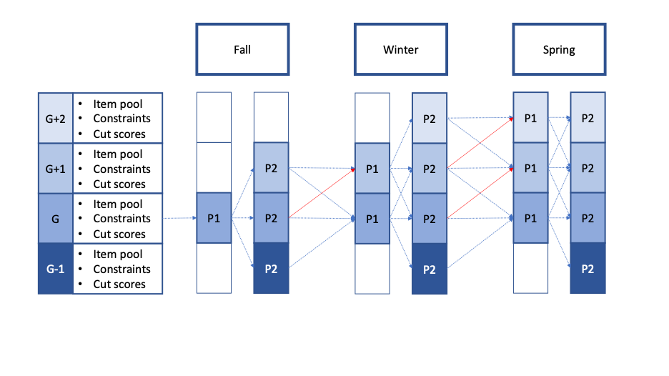

# ThyCAT 
Through-Year Computerized Adaptive Testing

Through-Year Computerized Adaptive Testing (**ThyCAT**) is an extension of the shadow-test approach to CAT implemented in the [`TestDesign`](https://github.com/choi-phd/TestDesign) package. The **ThyCAT** system is based on the assessment framework involving multiple tests administered throughout the year using multiple item pools vertically scaled and multiple phases (stages) of CAT within each test allowing transitioning from one item pool (and associated constraints) to another as deemed necessary to enhance the quality of measurement. 
